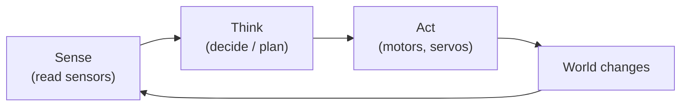

A robot that needs a human tugging at its controls is really just a very complicated remote-controlled car. Autonomy is what separates a *robot* from a *toy* — it's the ability to sense the world, decide what to do, and act without being told.

## What is Autonomy?

Autonomy means your robot can operate independently. It reads its sensors, applies some logic, and takes action — all by itself. The level of autonomy can range from simple ("stop when you see an obstacle") to sophisticated ("map this building and find the shortest route to the charging dock").

You'll often hear about **levels of autonomy**, borrowed from the self-driving car world:

- **Level 0** — You control everything manually.
- **Level 1–2** — The robot assists or shares control.
- **Level 3–4** — The robot handles most situations; you step in for edge cases.
- **Level 5** — Fully autonomous. No human needed at all.

Most maker robots sit comfortably at Level 1–3, and that's where most of the fun is.

Autonomous behaviour usually combines several building blocks: **sensors** to perceive the world, a **decision loop** to work out what to do, **actuators** (motors, servos) to carry out the action, and often **feedback** like PID control to keep things on track.

## The sense-think-act loop

Every autonomous robot, however simple or clever, runs the same loop over and over: **sense** the world, **think** about what to do, **act** on it — then sense again to see what changed. That closed loop is the heart of autonomy:

Your very first autonomous behaviour — "if the sensor reads under 10 cm, reverse and turn" — is this whole loop in one `if` statement. Everything more advanced (SLAM, path planning, vision) just makes the "think" box cleverer while the loop stays exactly the same.

## Why robot builders care

Autonomy is the payoff. You spend hours soldering, printing parts, and writing code — and then you set your robot loose and watch it navigate a room by itself. That moment never gets old.

More practically, autonomy opens up genuinely useful projects. A robot that follows a line, avoids obstacles, maps a space, or returns to its dock when the battery is low is doing real work. These behaviours compound: add obstacle avoidance to line-following and you already have something impressive.

Autonomy is also where all the other elements of robotics come together. Sensors feed data in. Algorithms (PID, SLAM, computer vision) process it. Motors act on the result. Learning how autonomy works gives you a reason to learn everything else.

## Get started

The best way to understand autonomy is to build it in stages. Start with a single rule: "if the ultrasonic sensor reads less than 10 cm, reverse and turn." That one `if` statement is your first autonomous behaviour. Build from there.

The [MicroPython Robotics Projects with the Raspberry Pi Pico](/learn/micropython_robotics/01_intro.html) course walks you through controlling motors and reading sensors on the Pico, then combining them into robots that can act on their own.

Once you've got basic obstacle avoidance working, [SMARS](/learn/smars/00_intro.html) is a proven chassis to experiment on — compact, 3D-printable, and well-documented.

For a glimpse of more advanced autonomy, the post on [Viam SLAM](/blog/viam-slam.html) shows how a robot can build a map of its environment in real time.

Autonomy isn't a single technique; it's a mindset. Every sensor reading your robot can act on is one less thing you need to control yourself. Start small, stack behaviours, and enjoy watching your creation make its own choices.
