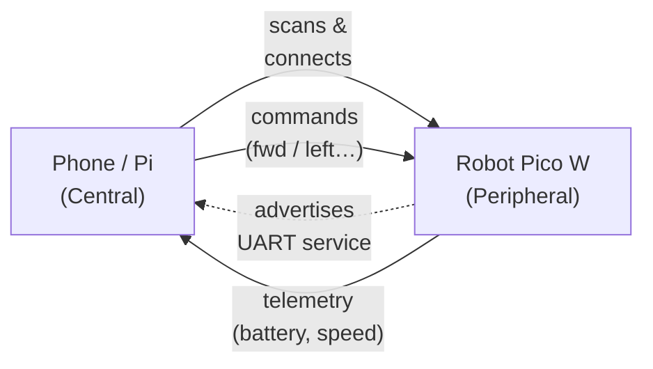

Cut the cables. Bluetooth is one of the most satisfying upgrades you can make to a robot — suddenly you can drive it from across the room, stream sensor readings to your laptop, or build a proper handheld controller without a single trailing wire.

## What is Bluetooth?

Bluetooth is a short-range radio standard that operates in the 2.4 GHz band, typically covering 10–100 metres depending on the hardware. The version you'll encounter most in robotics is **Bluetooth Low Energy (BLE)**, introduced with Bluetooth 4.0. BLE sips power compared to classic Bluetooth, making it ideal for battery-powered robots.

There are two common ways BLE devices communicate:

- **Central / Peripheral** — your phone or Raspberry Pi acts as the *central*, connecting to a robot that acts as the *peripheral*.
- **UART over BLE** — many modules emulate a serial port, so your code treats Bluetooth just like a wired UART connection. Simple and familiar.

The **Raspberry Pi Pico W** has onboard BLE support via the CYW43439 chip, and MicroPython's `bluetooth` module makes it straightforward to use without any external modules.

## Central and peripheral

In a BLE link the **peripheral** advertises that it's available, and the **central** scans, finds it, and connects. For a robot, the robot is usually the peripheral and your phone or Pi is the central. With UART-over-BLE the link then behaves just like a wired serial cable:

Once connected, data flows both ways over a virtual serial port — which is why so much wired-UART example code works almost unchanged over Bluetooth.

## Why robot builders care

Bluetooth solves one of the most common beginner frustrations: needing a USB cable dangling from your robot every time you want to test it. With Bluetooth you can:

- **Drive and steer** a wheeled robot from your phone or a custom gamepad.
- **Log sensor data** (speed, heading, battery voltage) in real time to a PC.
- **Pair two Picos together** so a handheld controller talks directly to the robot with no internet connection needed.

BLE's low power draw means a small LiPo can run your Pico W's radio for hours, not minutes.

## Get started

The quickest first project is a Bluetooth-controlled buggy. Flash MicroPython onto a Pico W, use the built-in `bluetooth` module to advertise a UART service, and write a tiny phone app (or use a generic BLE terminal app) to send forward/back/left/right commands.

Kevin has walked through exactly this on the site — start with [Bluetooth remote controlled robot](/blog/bluetooth-remote.html), which shows the full MicroPython code for a Pico W-powered bot. When you're ready to level up the hardware, [Bluetooth Remote Control Custom PCB](/blog/bluetooth-remote-pcb.html) covers designing a dedicated controller board with a proper PCB layout.

Once you're comfortable with one-way control, the next challenge is bidirectional comms — sending telemetry back to the controller as well as receiving commands. [Two-Way Bluetooth Communication Between Raspberry Pi Picos](/blog/two-way-bluetooth.html) covers that pattern clearly, and [Pi to Pico W Bluetooth Communication](/blog/pi-to-pico-bluetooth.html) shows how to link a full Raspberry Pi to a Pico for richer onboard processing.

A good beginner checklist:

1. Get a BLE terminal app on your phone (e.g. nRF Connect or LightBlue).
2. Run a Pico W BLE UART example and confirm you can see it advertising.
3. Send a single character and blink an LED in response.
4. Build up to motor control from there.

That first blink-on-command moment is genuinely exciting — wireless control you built yourself, no cloud, no wires.
