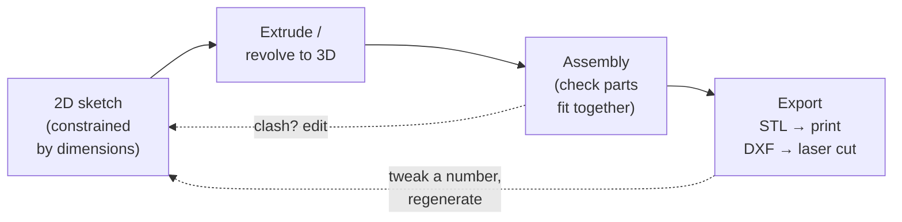

Before you cut, print, or solder anything, CAD lets you build your robot on a screen first. Get the design right in software and the physical build becomes much less painful.

## What is CAD?

CAD stands for **Computer-Aided Design**. It's the process of creating precise 2D drawings or 3D models of parts and assemblies using dedicated software. Instead of sketching on paper and hoping the dimensions work out, you model every component in a virtual workspace where measurements are exact, parts fit together on screen before they exist in the real world, and changes take seconds rather than hours.

For robot builders, CAD typically means **3D parametric modelling** — you define shapes using dimensions and constraints, so changing one number (say, a motor mounting hole diameter) updates the entire model automatically. Popular tools include **Fusion 360** (free for hobbyists, cloud-based, very capable), **FreeCAD** (fully open source, runs locally), and **Onshape** (browser-based, free tier available).

## The sketch-to-solid workflow

Almost every part follows the same core loop: draw a 2D **sketch**, **extrude** it into a 3D solid, combine parts into an **assembly** to check the fit, then **export** for fabrication. Because it's parametric, changing one dimension ripples through the whole model:

That dashed feedback arrow is the whole point of parametric CAD: the motor shaft turns out to be 5 mm not 4 mm, you change one number, and every dependent feature updates — no redrawing from scratch.

## Why robot builders care

Almost every custom robot needs at least one bespoke part: a chassis plate, a bracket to hold a sensor at the right angle, a gear with a specific tooth count, a wheel hub. Without CAD you're guessing dimensions, cutting and reprinting repeatedly, and wasting both filament and time.

CAD solves this in a few concrete ways:

- **Fit checks** — assemble all your parts virtually and see if they clash before anything is printed.
- **Iterating fast** — tweak a dimension, re-export the STL, re-print in minutes rather than starting from scratch.
- **Sharing** — export a STEP or STL file so anyone with a 3D printer can reproduce your design exactly.
- **Documentation** — a parametric model is self-documenting; the numbers are right there.

Even a simple robot like SMARS has around a dozen unique printed parts. Designing those in CAD rather than winging it is what makes the robot reliable rather than approximate.

## Get started

The gentlest on-ramp is FreeCAD — it's free, open-source, and runs entirely on your own machine. The [Introduction to FreeCAD for Beginners](/learn/freecad/01_introduction_to_freecad.html) course walks you through the interface from scratch: sketching, extruding, and constraining your first solid shapes. Once you're comfortable with the basics, try [Building SMARS with FreeCAD](/learn/freecad_smars/00_intro.html), which takes you through designing a real printable robot step by step.

If you prefer Fusion 360, the [Build a SMARS Robot in Fusion 360](/learn/smars_fusion360/00_intro.html) course covers the same end goal using Autodesk's toolset. And once you want to go beyond flat plates and simple extrusions, check out [Creating Gears in Fusion 360](/blog/creating-gears-in-fusion-360.html) — gears are one of those things that look complicated but are completely manageable once you know where the gear generator lives.

A good first mini-project: design a simple L-shaped bracket. Sketch a rectangle, add a second rectangle at 90°, extrude both, and print it. That one exercise teaches you sketching, constraints, and the sketch-to-solid workflow that underpins every other part you'll ever make.
