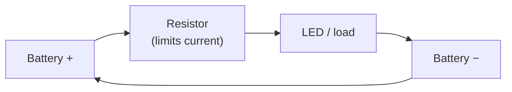

Every robot you build is, at its core, a collection of closed loops. Break the loop and nothing works. Understand it and you unlock every project that follows.

## What is a Circuit?

A circuit is a complete path through which electrical current can flow. At minimum it needs three things: a power source (like a battery), a load (like an LED or motor), and a conductor (wire) connecting them in a closed loop.

There are two fundamental arrangements:

- **Series circuits** — components are chained one after another. The same current flows through each one. If one breaks, the whole path goes dead.
- **Parallel circuits** — components share the same two connection points. Each gets the full voltage. One failing doesn't stop the others.

Most real robot circuits mix both arrangements.

A few numbers worth knowing early on: most microcontroller GPIO pins run at **3.3 V** and can safely source or sink around **10–16 mA**. That's enough to blink an LED (with a series resistor) but not enough to drive a motor directly — you need a driver chip or transistor in between. Getting comfortable with these limits saves a lot of burnt pins.

## Series and parallel

The two ways to connect components. In **series** the same current passes through everything in a single line; in **parallel** each branch sees the full voltage and current splits between them:

```
        SERIES                          PARALLEL

   +────[R1]────[R2]────+        +───────┬───────┬───────+
   |                    |        |       |       |       |
  (+)                  (−)      (+)    [R1]    [R2]     (−)
  Battery            Battery   Battery  |       |     Battery
   |                    |        |      |       |       |
   +────────────────────+        +──────┴───────┴───────+

  one path, same current      multiple paths, same voltage
  break it anywhere = dead    one branch fails, others live
```

## The loop

Every working circuit is a closed loop: power leaves the battery's positive terminal, flows through the load, and returns to the negative terminal. Break that loop at any point and current stops:



## Why robot builders care

You cannot debug a robot without understanding circuits. When your motor twitches once and dies, or your sensor reads garbage, the fault is almost always in the circuit — a loose wire, a missing pull-up resistor, a shared ground that isn't actually connected.

Circuits also determine safety. Too much current through an LED destroys it in seconds. A motor drawing stall current without protection can kill a voltage regulator or a battery. Knowing Ohm's Law (V = IR) and applying it before you wire things up means your components survive to run the actual code.

## Get started

The best first circuit is an LED with a current-limiting resistor, powered by a 3.3 V or 5 V pin. Calculate the resistor value (R = (Vcc − Vf) / I, where Vf ≈ 2 V for a red LED and I = 10 mA), build it on a [breadboard](/learn/robotics_101/00_overview.html), and check it works before adding any code.

Once that clicks, move to controlling the LED from a microcontroller pin. The [Raspberry Pi Pico GPIO Mastery course](/learn/micropython_gpio/00_intro.html) walks you through exactly this — starting with pin types and voltage levels, then driving LEDs and motors from MicroPython. It's the circuit-to-code bridge that makes everything practical.

When your robot needs more than a coin cell, circuit thinking extends to power distribution. The post [Power up your robot projects](/blog/power.html) covers batteries, level shifters, and keeping different voltage rails from interfering with each other — all circuit fundamentals in a real build context.

A solid mental model of circuits is the foundation everything else sits on. Get this right early and the rest of the table starts to make a lot more sense.
