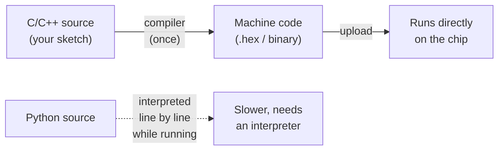

C and C++ are the workhorses of the robotics world. If a chip is moving a motor or reading a sensor right now, there's a good chance C or C++ wrote the rules.

## What is C/C++?

C is a low-level programming language created in the early 1970s. C++ arrived a decade later and added object-oriented features on top. Together they're often written as "C/C++", because embedded code regularly mixes both styles.

What makes them special is control. You decide exactly how memory is used. You decide exactly when things happen. There's very little standing between your code and the hardware — which means you can squeeze every last millisecond of performance out of a tiny microcontroller.

The Arduino ecosystem is built on C/C++. When you write an Arduino sketch, you're writing C++ — the `setup()` and `loop()` functions, `digitalWrite()`, `Serial.print()`, all of it compiles down to native machine code that runs directly on the chip.

## Compiled, not interpreted

The reason C/C++ is so fast is that it's **compiled** ahead of time. Your source is translated once into raw machine code the chip runs directly — there's no interpreter sitting in the loop while the robot is running:

That upfront compile step is why a C/C++ control loop can react in microseconds and fit in an Arduino Uno's 2 KB of RAM — there's no interpreter or garbage collector competing for time or memory.

## Why robot builders care

Robots have hard real-time requirements. A motor controller that's even a few milliseconds late can cause a robot to wobble, overshoot, or crash. C/C++ lets you write code that responds in microseconds rather than milliseconds, with no garbage collector or interpreter getting in the way.

Memory matters too. A typical Arduino Uno has 2 KB of RAM. Python wouldn't survive in there. C/C++ fits comfortably, leaving room for your sensor data, PID loops, and motor commands.

Beyond Arduino, C++ powers ROS (Robot Operating System) nodes, real-time control on Raspberry Pi, and the firmware inside commercial robots from warehouse bots to space rovers.

## Get started

The easiest entry point is Arduino. You write sketches in the Arduino IDE, upload them over USB, and the hardware responds immediately — no server, no interpreter, no waiting.

Start with [Learn how to program SMARS with Arduino](/learn/smars_code/01_lesson_01.html) — a hands-on course that takes you from blinking LEDs to driving a real wheeled robot, all in Arduino C++. It's a great way to see how C++ concepts like variables, loops, and functions translate directly into robot behaviour.

Already know some Python? The [Arduino to MicroPython Quick Start Guide](/learn/arduino_to_python/00_intro.html) shows C++ and MicroPython side by side, so you can see exactly where the two languages agree and where they differ — a surprisingly effective way to deepen your C++ understanding.

If you want to pick a board, [The Best Arduino Robot for Beginners](/blog/best-arduino-robot.html) walks through which Arduino hardware suits different project types and budgets.

A good first mini-project: wire up an LED and a button to an Arduino Uno and write a sketch that turns the LED on only while the button is held. You'll practise `pinMode()`, `digitalRead()`, `digitalWrite()`, and the main `loop()` — the four foundations of almost every Arduino program ever written.

Once you're comfortable with that, add a motor driver and you're already halfway to a working robot. That's the thing about C/C++ — the distance from "hello, LED" to "hello, robot" is shorter than you'd think.
