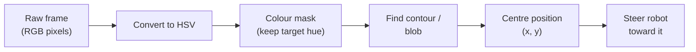

Robots that can only sense the world through buttons and bump switches are missing a trick. Add a camera and some computer vision, and suddenly your robot can recognise faces, count objects, track a ball, or read a QR code — all in real time.

## What is Computer Vision?

Computer vision is the field of making computers (and robots) understand images and video. Rather than just capturing pixels, you write code that analyses those pixels to extract useful information: "there's a person in frame", "that object is 30 cm away", "the line is to the left".

The most widely used library is **OpenCV** — open-source, fast, and well-supported in both Python and C++. On a Raspberry Pi you can process several frames per second with OpenCV alone. Pair it with a dedicated AI accelerator (like the Raspberry Pi AI Camera's onboard NPU) and you're doing full object detection at 30 fps on hardware you can hold in your hand.

Common techniques include:

- **Colour filtering** — isolate objects by hue (great for line-following robots)
- **Edge detection** — find the outlines of objects in a scene
- **Face detection** — locate faces using pre-trained Haar cascades or neural networks
- **Object detection** — identify and locate labelled objects (people, cups, obstacles)
- **Pose estimation** — track the position of a human body or hand in 3D space

## From pixels to meaning

Computer vision is a stack of processing steps that turn a raw frame into something the robot can act on. A typical colour-tracking pipeline filters the image down to just the bits that matter, finds the blob, then works out where it is:

Each stage throws away information you don't need so the next stage has less to chew on — which is exactly how a humble Raspberry Pi keeps up with live video.

## Why robot builders care

A robot that can see is a robot that can react. Computer vision is the bridge between raw sensor data and meaningful decisions. It's how an autonomous rover avoids obstacles it's never encountered, how a robot arm picks the right component off a tray, and how a pet robot learns to follow you around the room.

Even simple colour-blob detection is enough to build something genuinely impressive — a ball-chasing robot or a line-follower that steers smoothly at speed. From there, you can layer in more powerful techniques as your confidence grows.

## Get started

The best first project is face detection — it's visual, immediate, and satisfying. Kevin's [Face Detection tutorial](/blog/face-detection-trilobot.html) shows you how to set up OpenCV on a Raspberry Pi and get a live feed tracking faces within an afternoon.

Once you're comfortable with that, the full [Computer Vision on Raspberry Pi with CVZone](/learn/cvzone/00_intro.html) course walks you through hand tracking, pose detection, and building interactive demos using the CVZone library on top of OpenCV.

When you're ready to go further, [Building Object Detection Models with the Raspberry Pi AI Camera](/learn/object_model/00_intro.html) takes you from collecting your own dataset right through to deploying a custom-trained model that runs in real time on the edge — no cloud required.

A concrete first step: install OpenCV on your Raspberry Pi (`pip install opencv-python`), point a USB webcam at something colourful, and write ten lines of Python to isolate that colour. You'll have a working blob tracker before your tea goes cold.
