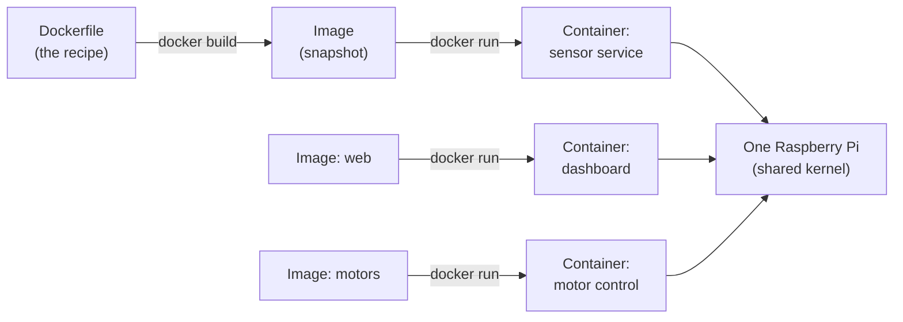

You know that feeling when your robot code works perfectly on your laptop, then falls apart the moment you copy it to your Raspberry Pi? Docker fixes that.

## What is Docker?

Docker is a tool that packages your software — code, libraries, dependencies, settings — into a single portable unit called a **container**. Think of it like a lunchbox: everything the app needs is sealed inside, so it doesn't matter what's installed on the machine running it.

A container is not a virtual machine. It shares the host operating system's kernel, which keeps it lean and fast. A typical container starts in under a second. You define exactly what goes inside using a plain text file called a `Dockerfile`, and Docker builds the image from that recipe every time.

Key ideas to know:

- **Image** — the built snapshot (the recipe made real)
- **Container** — a running instance of an image
- **Docker Hub** — a public registry where you pull ready-made images (Nginx, Python, ROS, etc.)
- **docker-compose** — a tool to spin up multiple containers together with one command

## Recipe to running container

The flow is always the same: a `Dockerfile` (the recipe) is built into an **image** (the snapshot), and an image is run as one or more **containers**. Crucially, every container shares the host's kernel, so you can run several side by side on one Raspberry Pi without them clashing:



Each container is sealed in its own tidy environment, so the sensor service can need one Python version while the dashboard needs another — and neither trips over the other.

## Why robot builders care

Robots run software that depends on specific library versions, GPIO drivers, or system packages. Docker locks all of that in. You can run your sensor-reading service, your web dashboard, and your motor controller as separate containers on the same Raspberry Pi — each in its own tidy environment, none of them clashing.

It also makes updates safe. If a new version breaks something, you roll back to the previous image. No re-flashing SD cards, no hunting down which `pip install` ruined things.

For a cluster of Pis (a Swarm), Docker becomes even more powerful. You describe the desired state — "run three copies of this service" — and Docker figures out which nodes to use.

## Get started

Install Docker on a Raspberry Pi by following the [official get-started script](https://get.docker.com), then try running a container straight away:

```bash
docker run hello-world
```

That single command pulls an image and proves everything works. From there, write your first `Dockerfile` for a Python script, build it, and run it.

Kevin's [Docker course](/learn/docker/00_intro.html) walks you through containers from scratch — images, volumes, networking, and all. Once you're comfortable, the [Raspberry Pi 5 Cluster with Docker Swarm](/learn/docker_swarm/00_intro.html) course shows you how to deploy across multiple Pis. If you want to go further, the [From Docker to Podman](/learn/podman/01_intro_to_podman.html) course covers a daemonless, rootless alternative that's popular for production deployments.

The real payoff comes when you commit your `Dockerfile` to Git and your whole robot setup becomes reproducible by anyone — including future you.
