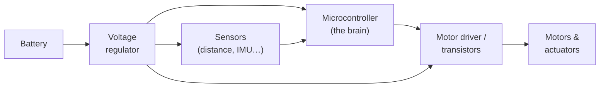

Every robot you'll ever build is, at its core, a collection of electrons being pushed in the right direction at the right time. Electronics is the skill that lets you do the pushing.

## What is Electronics?

Electronics is the branch of physics and engineering that deals with controlling the flow of electric current through components — resistors, capacitors, transistors, LEDs, and hundreds more.

In practical terms, it's the study of the parts on your circuit board and how they work together. A resistor limits current. A capacitor stores charge briefly and smooths out noise. A transistor acts as a switch or amplifier. Combine them correctly and you can build sensors, motor drivers, communication circuits, and power regulators — everything a robot needs to come alive.

You don't need a physics degree to get started. Most robot builders work at the component level: reading a datasheet, choosing the right resistor, wiring up a sensor breakout board. That's entirely learnable with a breadboard and a multimeter.

## How it fits together

Every robot's electronics break down into the same handful of blocks. Power feeds the brain and the muscles; sensors feed information *in*; the microcontroller decides; drivers turn tiny logic signals into real-world motion:

Learn what each block does and almost any robot schematic becomes readable — you're just looking at these same pieces wired up in a particular way.

## Why robot builders care

Electronics underpins almost every other topic in this Periodic Table. Without it you can't:

- **Power your robot** — You need to understand voltage, current, and power to choose the right battery and avoid frying your board.
- **Drive motors and servos** — DC motors, steppers, and servos all need driver circuits that bridge the gap between a microcontroller's tiny signal pins and the real-world current a motor demands.
- **Read sensors** — Ultrasonic rangefinders, IMUs, cameras, and line sensors all connect to your robot through circuits you need to understand and wire correctly.
- **Protect your hardware** — A missing current-limiting resistor can kill an LED in seconds. A miswired motor driver can destroy a microcontroller. Electronics knowledge is your robot's first line of defence.

It's also genuinely satisfying. There's a particular pleasure in understanding exactly *why* a circuit works, not just copying it from a tutorial.

## Get started

The best first project is wiring an LED to a Raspberry Pi Pico or Arduino with a current-limiting resistor and making it blink. It's simple, but it teaches you three fundamentals at once: voltage, current, and Ohm's Law (element **Oh**).

From there, Kevin's [Robotics 101 course](/learn/robotics_101/00_overview.html) covers the electronics concepts you need to start building real robots — including how to read schematics, pick components, and wire up sensors. Once you're comfortable connecting individual sensors over I2C and SPI, the [Talking to the World — Working with I2C and SPI course](/learn/i2c_spi/00_intro.html) takes you deeper into the communication protocols that tie electronic modules together.

A multimeter is your single best investment at this stage — it lets you measure voltage, check continuity, and diagnose faults. Pair it with a breadboard so you can prototype circuits without soldering, and you have everything you need to explore.

Electronics is the foundation everything else is built on. Get comfortable here and the rest of the table opens up.
