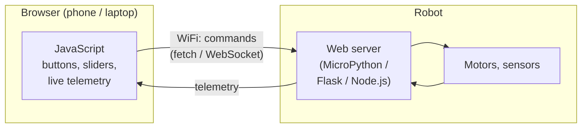

JavaScript is the language of the web — and it turns out the web is a surprisingly handy place to control robots from.

## What is JavaScript?

JavaScript (JS) is a dynamically typed, interpreted programming language that runs natively in every modern browser — no install needed. It also runs on servers and microcontrollers via [Node.js](https://nodejs.org/), a runtime built on Chrome's V8 engine. That means you can use the same language to write a control dashboard in your browser, a WebSocket server on a Raspberry Pi, and even firmware on some boards.

Key facts worth knowing:

- **Runs client-side** — your browser executes it directly, no round-trip to a server.
- **Event-driven** — callbacks and promises handle button clicks, sensor readings, incoming messages.
- **Johnny-Five** — a popular Node.js library that lets you talk to Arduinos and Raspberry Pis with JS code.
- **p5.js** — a creative coding library that makes it easy to build visual robot simulations and sensor displays.

## How a JS dashboard fits in

The killer use case is the **robot control dashboard**. JavaScript runs in the browser on your phone or laptop; the robot runs a small web server. Press a button and JS sends a request over WiFi; the robot acts and sends telemetry back to update the page:

Because it's just a web page, any device with a browser becomes a control panel — no app to install, no app store, nothing to sign.

## Why robot builders care

You need sliders for motor speed, buttons for direction, live camera feeds, and real-time telemetry. Building that as a web page means any device with a browser — phone, tablet, laptop — becomes a control panel, with no app to install.

Pair a small web server running on your robot (MicroPython, Flask, or Node.js) with a JavaScript front end, and you have a wireless remote control you built yourself. This combination shows up constantly in hobby robotics: a Raspberry Pi hosts the server, and your browser connects over WiFi.

Johnny-Five takes things further. With a few lines of JS you can blink LEDs, read sensors, and sweep servos — all from a Node.js script on your laptop wired to an Arduino or a Pi.

## Get started

The fastest first step is to add a small web interface to a project you already have running. The [Simple Robot Arm](/blog/simple-robot-arm.html) project on this site is a great example — it uses JavaScript sliders in a browser to send servo positions to a MicroPython web server running on the robot. Read through that code to see exactly how the browser and the microcontroller talk to each other.

If you want to go further with Node.js and hardware control, the [Robotics 101](/learn/robotics_101/00_overview.html) course gives you a solid grounding in how software and hardware fit together before you dive into a specific framework.

For browser-side creative work — visualising sensor data, drawing path-planning grids, animating a virtual robot — look at [p5.js](https://p5js.org/). Its `setup()` / `draw()` loop will feel familiar if you've ever written Arduino code.

A good first micro-project: build an HTML page with four buttons (forward, back, left, right) that sends a `fetch()` request to a local server each time you press one. You'll have a working browser remote control in under 50 lines of code.
