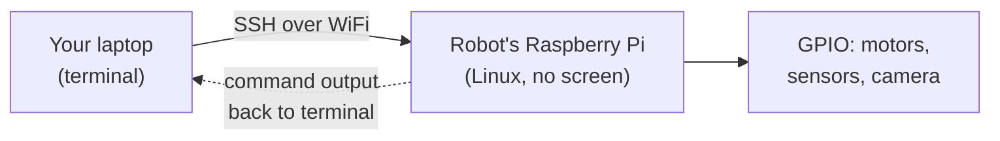

When you power up a Raspberry Pi and a terminal prompt appears, you're looking at Linux. It runs on more robots than any other operating system — and once you know your way around it, everything clicks into place.

## What is Linux?

Linux is a free, open-source operating system kernel created by Linus Torvalds in 1991. Today it comes packaged in hundreds of *distributions* — Raspberry Pi OS, Ubuntu, Debian, and Fedora being some of the most popular. The version you'll meet most often as a robot builder is **Raspberry Pi OS**, a Debian-based distro tuned for the Pi's ARM processor.

Unlike Windows or macOS, Linux is built to be controlled from the command line. That might sound daunting, but it's actually what makes it so powerful for robotics. You can SSH into your robot from across the room, run scripts without a keyboard or screen attached, and schedule tasks to fire automatically on boot — all from a single terminal window.

## Running headless

The Linux superpower for robots is going **headless** — no monitor, keyboard or mouse attached. Your robot's Pi joins WiFi, and you control it entirely over **SSH** from your laptop on the same network:

This is what lets a robot drive around untethered while you sit at your desk running commands, editing code with `nano`, and installing libraries with `apt` — all through one terminal window.

## Why robot builders care

Almost every serious robotics platform runs Linux under the hood:

- **ROS (Robot Operating System)** officially supports Ubuntu Linux and is awkward to run anywhere else.
- **Raspberry Pi** ships with Linux by default, giving you a full OS on a £10 computer.
- **Docker** — used to containerise robot software — is a first-class Linux tool.
- Remote access via SSH means you can monitor and tweak your robot over WiFi without plugging in a monitor.
- Package managers like `apt` let you install camera libraries, motor drivers, and sensor SDKs with a single command.

You don't need to become a Linux expert to build robots. But knowing a handful of commands — `ls`, `cd`, `sudo`, `apt`, `ssh`, `nano` — will save you hours of frustration and unlock capabilities that a graphical desktop simply can't match.

## Get started

The best first step is hands-on practice at the command line. Kevin's [Introduction to the Linux Command Line on Raspberry Pi OS](/learn/linux_intro/01_intro_terminal.html) course walks you through navigation, file management, software installation, and basic scripting — everything you need to feel at home in a terminal.

Once you're comfortable with the basics, try putting Linux to work. The [Build your own home server with Raspberry Pi 5](/blog/build-a-home-server.html) post shows Linux running Docker and serving real networked services — a great taste of what a production robot brain looks like. When you're ready to go deeper, the [Docker course](/learn/docker/00_intro.html) teaches you how to containerise your robot software so it runs the same way every time, on any machine.

Start with one command at a time. Linux rewards curiosity — the more you explore, the more it gives back.
