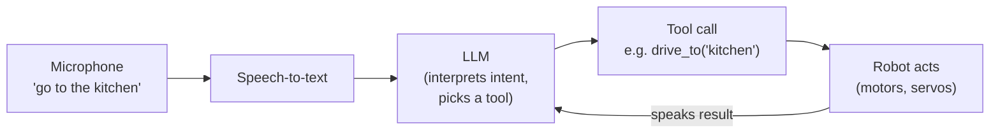

Give your robot a brain that speaks plain English. LLMs have changed what's possible for makers — and you don't need a data centre to use one.

## What is an LLM?

A Large Language Model (LLM) is a type of AI trained on vast amounts of text. It learns patterns in language so well that it can answer questions, write code, summarise information, and hold back-and-forth conversations. Models like GPT-4, Gemini, DeepSeek, and LLaMA are all LLMs.

What makes them exciting for robotics is their ability to interpret *intent*. Instead of programming every possible command, you can let a robot understand "move forward a bit and then stop when you see something" in natural language and figure out what to do.

LLMs range from enormous cloud-hosted models (billions of parameters, running on server farms) to compact versions that fit on a Raspberry Pi 5.

## From spoken word to robot action

The reason LLMs are such a leap for robots is that they slot neatly between a microphone and the motors. Speech becomes text, the model works out what you *meant* and which tool to call, and that call drives the hardware:

The clever bit is **tool use**: you define functions like `drive_forward()` or `read_distance()`, and the model decides when to call them. You no longer write an if/else tree for every phrase — the LLM maps free-form language onto the handful of actions your robot can actually do.

## Why robot builders care

Until recently, giving a robot a conversational interface meant writing elaborate if/else trees or training your own classifier — both are significant projects. LLMs short-circuit all of that.

Here's what LLMs unlock on your robot:

- **Voice interfaces** — pair an LLM with a speech-to-text library and your robot can take spoken instructions
- **Task planning** — ask the LLM to break a high-level goal ("fetch me a coffee") into a sequence of low-level actions
- **Tool use** — modern LLMs can call functions you define, so the model can command motors, read sensors, or query a database
- **Self-documentation** — the LLM can narrate what the robot just did, which is brilliant for logging or tutorials

The trade-off is compute. Cloud APIs (OpenAI, Anthropic, Google) are the easiest route but cost money and need internet. Local models via [Ollama](https://ollama.com) run offline on your own hardware — a Pi 5 or a mini PC — at the cost of some speed.

## Get started

The fastest way in is to run a local model with Ollama and call it from Python. Kevin's guide [Ollama — local ChatGPT on Pi 5](/blog/ollama.html) walks you through installing Ollama on a Raspberry Pi and sending your first prompt in about 20 minutes.

If you want to go further and build an autonomous agent that uses an LLM as its reasoning core, check out the [OpenClaw on Raspberry Pi](/learn/openclaw_raspberry_pi/00_intro.html) course — it covers running local AI agents in Docker, wiring up tools for the model to call, and keeping everything self-hosted.

For the bleeding edge, [DeepSeek-R1 on a Raspberry Pi](/blog/deepseek-on-pi.html) shows how a compact reasoning model fits on a Pi with Docker, which is genuinely remarkable for the cost.

A solid first project: set up Ollama, pick a small model (llama3.2:3b is a good starting point), and write a 20-line Python script that reads a command from your keyboard, passes it to the model, and prints the response. From there you can replace the keyboard with a microphone and the print statement with a motor command — and suddenly you've got a robot that listens.
