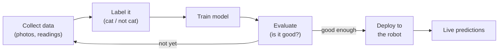

Instead of telling your robot exactly what to look for, machine learning lets you *show* it thousands of examples and have it figure out the pattern itself. That single shift changes everything.

## What is Machine Learning?

Machine learning (ML) is a branch of AI where a program improves its performance through experience rather than through rules you write by hand. You feed it labelled data — images of cats, sensor readings before a motor stalls, sonar distances paired with "obstacle / clear" decisions — and a training algorithm adjusts the model's internal parameters until its predictions get good enough to be useful.

The three main flavours you'll meet in robotics are:

- **Supervised learning** — you supply labelled examples (input → correct output). Most image classifiers and object detectors work this way.
- **Unsupervised learning** — the algorithm finds clusters or structure in unlabelled data. Useful for anomaly detection and mapping.
- **Reinforcement learning** — the robot tries actions, gets rewards or penalties, and learns a policy. This is how many walking and balancing controllers are trained.

## The workflow

Every ML project, big or small, follows the same loop. You gather and label data, train a model on it, check how well it does, and only then deploy it to the robot — looping back to collect more data whenever it gets things wrong:

The big mental shift from traditional coding is in the middle: you never write the rules yourself. The training step *learns* them from your labelled examples, which is exactly why messy, varied real-world data makes a stronger model.

## Why robot builders care

Robots encounter a messy, unpredictable world. Writing `if colour == "red": stop` works in a lab; it falls apart the moment the lighting changes. An ML model trained on varied examples handles that variation naturally.

Concrete uses you'll run into quickly:

- **Object detection** — spot a ball, a person, or an obstacle in a camera frame.
- **Gesture or voice recognition** — trigger actions from a wave or a word.

Even a small model trained on a few hundred images can be surprisingly capable once you understand the workflow: collect data, label it, train, evaluate, deploy.

## Get started

The best first project is image classification because the feedback loop is fast and visual. Here is a concrete path:

1. **Build a dataset** — collect 50–100 photos each of two or three objects you care about. Your phone camera is fine.
2. **Train on the Pi AI Camera** — Kevin's course [Building Object Detection Models with Raspberry Pi AI Camera](/learn/object_model/00_intro.html) walks you through PyTorch training, optimisation for edge hardware, and deploying a live detector on real Raspberry Pi hardware.
3. **Try it on a robot** — the [Elf Detector project](/blog/elf-detector.html) shows how Kevin trained a model with Viam's point-and-click training tool and then dropped it straight onto a robot. It is a great template for any "spot this thing and react" idea.
4. **Go deeper with Computer Vision** — once your model is running, pair it with OpenCV (see the [Computer Vision with CVZone course](/learn/cvzone/00_intro.html)) to add tracking, distance estimation, and more.

Python is the lingua franca here. `scikit-learn` covers classical ML (decision trees, k-nearest neighbours, SVMs) and is a great place to learn the fundamentals. PyTorch and TensorFlow handle deep neural networks. Start with scikit-learn on simple sensor data, then move to a vision model when you are ready — the concepts transfer cleanly.
