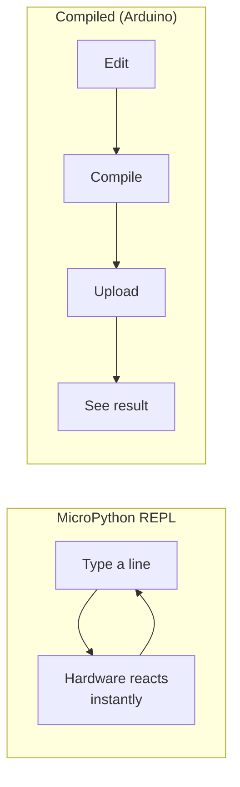

MicroPython lets you write Python on hardware that costs a few pounds and fits in your pocket. It is one of the best ways to get a robot doing real things, fast.

## What is MicroPython?

MicroPython is a lean implementation of Python 3 designed to run on microcontrollers. It was created by Damien George and first released in 2013 — it has just turned 13 years old. Instead of running on a full operating system, MicroPython runs directly on the chip's bare metal.

You get a Python prompt (called the REPL) over USB, WiFi, or serial. Type a line of code, press Enter, and the hardware responds immediately. No compile step, no upload delay — just fast feedback.

That instant loop is the big difference from a compiled language. With Arduino C++ you edit, compile, and upload before you see anything; with MicroPython's REPL you type a line and the hardware reacts on the spot:

Being able to poke a sensor or wiggle a pin one line at a time — before committing it to a loop — is why beginners get hardware working so quickly with MicroPython.

Common boards that support MicroPython include the Raspberry Pi Pico (and Pico W), the ESP32, and the BBC micro:bit. Most boards cost between £4 and £10.

Memory is tight — a Pico has 264 KB of RAM — but that is plenty for motors, sensors, displays, and wireless comms. You can even import your own modules from the onboard flash.

## Why robot builders care

Python is already the most popular language for robotics at the higher level (think Raspberry Pi and ROS). MicroPython lets you use the same syntax at the low level too — reading sensors, driving motors, and flashing LEDs — so there is only one language to learn.

The real-time control that microcontrollers provide (deterministic loop timing, direct GPIO access, hardware PWM) is exactly what robots need. With MicroPython you get that control without switching to C.

It is also forgiving. The REPL lets you test a sensor line-by-line before dropping it into a loop. When something breaks, the error message tells you which line. Beginners find that extremely helpful.

## Get started

The fastest first step is to flash MicroPython onto a Raspberry Pi Pico — it takes about two minutes. Hold BOOTSEL, plug in USB, drop the `.uf2` file onto the drive that appears, and you are done. Then open Thonny and type `print("hello, robot")`.

From there the [Learn MicroPython — The Basics](/learn/micropython/00_intro.html) course walks you through variables, loops, functions, and GPIO in a friendly, project-led way. When you are comfortable with the basics, [Intermediate level MicroPython](/learn/intermediate_micropython/01_intro.html) covers classes, modules, and more advanced patterns for robot code.

If you already know Arduino, the [Arduino to MicroPython Quick Start Guide](/learn/arduino_to_python/00_intro.html) will get you up to speed quickly — it maps familiar Arduino concepts straight to their MicroPython equivalents.

For a practical project, the [MicroPython Robotics Projects with the Raspberry Pi Pico](/learn/micropython_robotics/01_intro.html) course builds real robots from scratch, including motor control, sensors, and wireless communication.

Within an afternoon you will have a robot responding to sensors with code you wrote yourself. That is the MicroPython promise — and it delivers.
