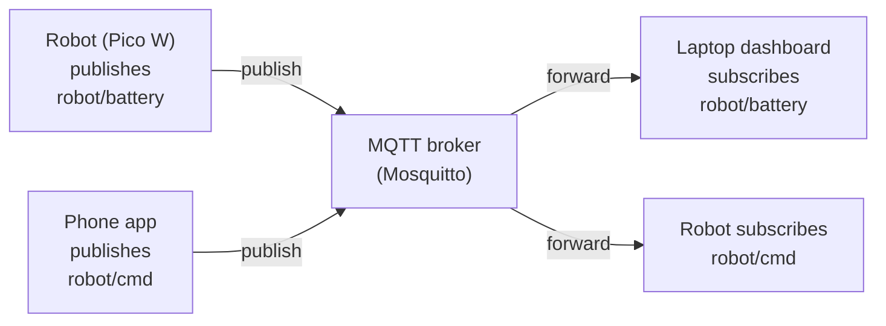

A tiny temperature sensor on a Pico, a dashboard on a laptop across the room, and a buzzer on a Pi in the garage — MQTT lets all three talk to each other with almost no code and very little bandwidth. It's the messaging protocol that makes robot networks actually practical.

## What is MQTT?

MQTT (Message Queuing Telemetry Transport) is a lightweight publish/subscribe messaging protocol designed for constrained devices and unreliable networks. It was originally built for monitoring oil pipelines by satellite in the 1990s, and that heritage shows: it's ruthlessly efficient.

The idea is simple. Devices publish messages to a named **topic** (like `robot/battery/voltage`). Other devices **subscribe** to topics they care about. A central **broker** — a small server, often Mosquitto running on a Raspberry Pi — routes messages between them. Publishers and subscribers never talk directly; they don't even need to know each other exists.

A minimal MQTT message carries as little as **2 bytes** of overhead, and Quality of Service (QoS) levels handle unreliable connections gracefully — from fire-and-forget up to guaranteed delivery.

## Publish and subscribe

Nothing talks to anything directly. A **publisher** sends a message to a topic on the **broker**, and the broker forwards it to every **subscriber** that asked for that topic. The robot can be a publisher and a subscriber at the same time:

Because publishers and subscribers only ever know the broker (never each other), you can add a second dashboard, a third robot, or swap the phone for a laptop without changing a single line on the other side.

## Why robot builders care

Robots produce a constant stream of data — distances, motor currents, temperatures, joint angles — and they need to receive commands in return. HTTP works fine for one-off requests, but it's clunky for continuous telemetry. MQTT is built for exactly this pattern.

- **Telemetry dashboards** — publish sensor readings from a MicroPython board; subscribe on a laptop and graph them live with Node-RED or Grafana.
- **Remote control** — subscribe to a `robot/cmd/velocity` topic on the robot; publish from a joystick app on your phone.
- **Multi-robot coordination** — each robot subscribes to a shared topic. One message from a controller fans out to the whole fleet instantly.

The MicroPython `umqtt.simple` library makes connecting a Pico W or ESP32 to a broker a sub-30-line job. Raspberry Pi boards can run the Mosquitto broker locally, keeping everything on your home network with no cloud dependency.

## Get started

The fastest way to see MQTT in action is to build a wireless sensor node. The [Hacky Temperature and Humidity Sensor](/blog/hacky-sensor.html) project does exactly that — a DHT22 wired to a Pico, readings published over MQTT, and a Node-RED flow collecting and storing them.

For a project that pipes live readings through a broker to a visual display, the [Weather Station Display](/blog/weather-station-display.html) walkthrough covers subscribing to topics, parsing payloads, and driving a screen — skills that transfer directly to robot dashboards.

For a cute robot that reacts to live data, the [WeatherBot](/blog/weatherbot.html) project uses an ESP8266 and MQTT to drive a servo from an incoming weather reading — swap the feed for any sensor topic and you have a reactive robot in minutes.

To set up your own broker, install Mosquitto on a Raspberry Pi (`sudo apt install mosquitto mosquitto-clients`) and test it with `mosquitto_pub` and `mosquitto_sub` before writing any Python. Once you see a message flow between two terminals, the rest falls into place quickly.
