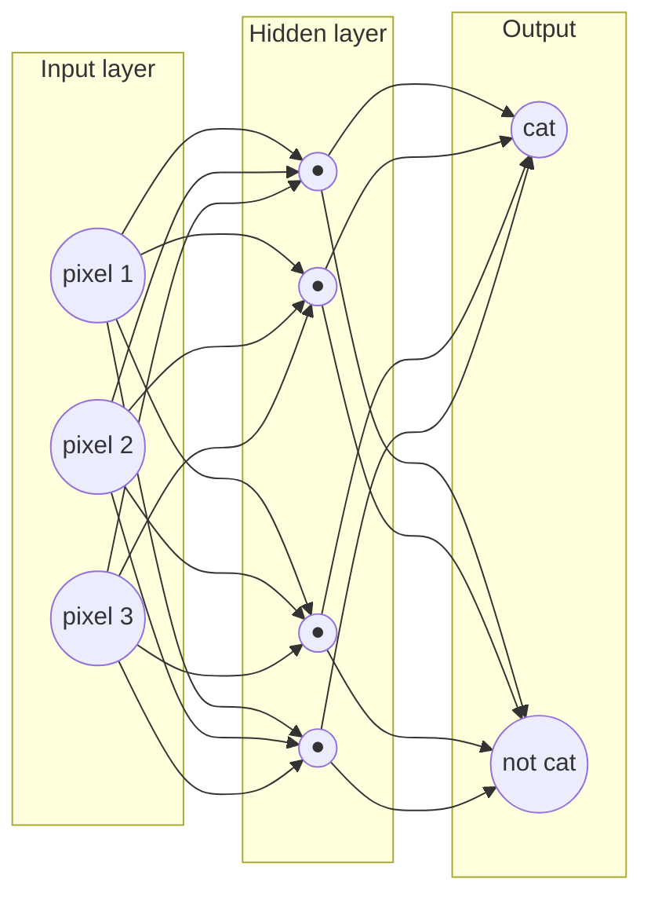

They're the engine behind face unlock, self-driving cars, and robots that can spot a rubber duck across a room. Neural networks are one of the most powerful tools you can add to a robot build.

## What is a Neural Network?

A neural network is a mathematical model loosely inspired by the brain. It's made up of **layers of nodes** — sometimes called neurons — connected by weighted links. You feed data in at one end (an image, a sensor reading, a stream of numbers) and a prediction comes out the other end.

The clever part is *learning*. You show the network thousands of examples — "this is a cat, this is not a cat" — and it gradually adjusts those weights until it gets the answers right. That process is called **training**.

Modern networks stack many layers on top of each other — that's where the term **deep learning** comes from. The type you'll meet most often as a robot builder is the **Convolutional Neural Network (CNN)** — brilliant at images, scanning for edges, shapes, and patterns.

## How the layers connect

Data enters the **input layer** (one node per feature — say, pixels), flows through one or more **hidden layers** where the weighted connections do the work, and a prediction emerges from the **output layer**. Every arrow carries a weight that training adjusts:

Training is just the slow tuning of every one of those weights until the output node that should fire (here, "cat") lights up more strongly than the others for the right inputs.

## Why robot builders care

A traditional robot checks conditions with if-statements: "if the sensor reads X, turn left." That works for simple tasks but breaks the moment the world gets messy.

Neural networks let your robot **generalise**. Train a CNN on hundreds of photos of a stop sign and it will recognise one in rain, shadow, or at an angle — without you writing a single rule for each case.

Practical uses on a robot build:

- Object detection so your rover avoids obstacles it has never seen before
- Gesture recognition to control a robot arm with hand signals
- Face or expression recognition for a companion robot

The hardware has caught up too. Boards like the Raspberry Pi 5 with the AI Camera HAT can run inference — using a trained network — fast enough for real-time video. Training still usually happens on a laptop or in the cloud.

## Get started

The best first step is to use a **pre-trained model** before you worry about training your own. Tools like TensorFlow Lite and ONNX let you drop a ready-made model straight onto a Raspberry Pi and start classifying images in an afternoon.

When you're ready, Kevin has hands-on courses that take you from gathering a dataset to running a custom model on the Pi:

- [Building Object Detection Models with Raspberry Pi AI Camera](/learn/object_model/00_intro.html) — covers PyTorch training, edge deployment, and real-time detection.
- [Computer Vision on Raspberry Pi with CVZone](/learn/cvzone/00_intro.html) — a gentler intro built on top of OpenCV.
- [Elf Detector project](/blog/elf-detector.html) — a fun worked example of training and deploying a custom ML model on a real robot.

Start with the CVZone course if you're new to computer vision, then move on to the object-detection course when you want to train from scratch. Once you've got inference running on hardware, neural networks stop feeling like magic and start feeling like a very useful tool.
