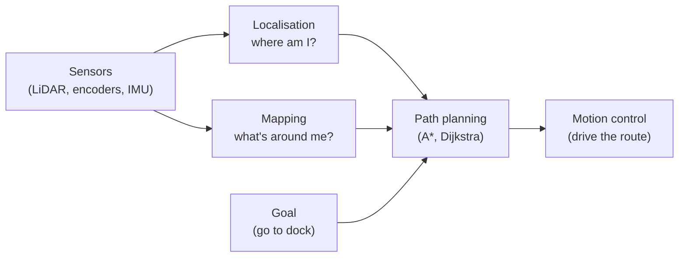

Your robot knows how to move. The harder question is: does it know *where* it is, and how to get somewhere useful without bumping into everything on the way?

## What is Navigation?

Navigation is the set of techniques that let a robot understand its position in the world, plan a path to a goal, and execute that plan in real time. It usually involves three interlocking problems:

- **Localisation** — "Where am I right now?" (using sensors like encoders, IMUs, or LiDAR)
- **Mapping** — "What does the world around me look like?" (building a model of the environment)
- **Path planning** — "How do I get from here to there without crashing?" (algorithms like A* or Dijkstra decide the route)

When a robot does all three at the same time, that's SLAM — Simultaneous Localisation and Mapping. It's one of the most powerful tricks in mobile robotics. Your robot explores an unknown space, builds a map as it goes, and uses that map to figure out where it is. Clever stuff.

At the simpler end, navigation can be as basic as wall-following: keep a fixed distance from the nearest wall and you'll eventually find your way out of a maze.

## The three questions

Navigation is really three questions answered together. *Where am I?* (localisation), *what's around me?* (mapping), and *how do I get there?* (path planning). The answers feed a motion controller that actually drives the robot:

Do localisation and mapping at the *same time* and you've got SLAM. Bolt path planning on top and the robot can be told "go to the charging dock" and route itself there around obstacles it discovers on the way.

## Why robot builders care

Without navigation, your robot is blind to the big picture. It can react to immediate obstacles but it can't plan. Add navigation and suddenly your rover can be told "go to the charging dock" and actually do it. Your maze-solving robot can find the exit in seconds instead of wandering forever.

Navigation is also where a lot of other skills come together. PID control keeps the heading steady. LiDAR or ultrasonic sensors feed the map. ROS provides ready-built packages for the heavy maths. GPS gives absolute position outdoors. It's the glue that makes a robot feel genuinely autonomous rather than just scripted.

Even on small robots, implementing basic navigation — say, dead reckoning with wheel encoders — teaches you an enormous amount about how robots perceive and model the world.

## Get started

A brilliant first navigation project is **maze solving with wall following**. All it needs is two distance sensors and some simple logic. Kevin's blog post [Arduino Alvik Maze Navigation](/blog/alvik-maze.html) walks through exactly this, starting with wall following and scaling all the way up to ROS2 SLAM.

When you're ready for full SLAM, the [Viam SLAM](/blog/viam-slam.html) project shows how to use a LiDAR sensor and the Viam robotics platform to map a real room and then navigate it — running on a Raspberry Pi. It's more involved, but the results are genuinely impressive.

For the underlying robot skills — motor control, sensors, and autonomous behaviour — the [MicroPython Robotics Projects with the Raspberry Pi Pico](/learn/micropython_robotics/01_intro.html) course gives you a solid foundation to build on.

Start with wall following. Get your robot to complete a maze. Then add a sensor, improve the algorithm, and keep iterating. Navigation is one of those topics where every small improvement feels like a big win.
