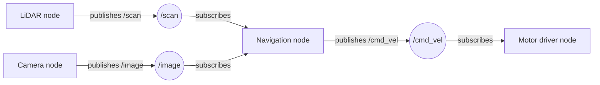

ROS is the closest thing robotics has to a universal language. It lets the sensors, motors, cameras and brains of your robot pass messages to each other in a clean, standardised way — so you spend less time writing glue code and more time actually building robots.

## What is ROS?

ROS stands for Robot Operating System, though it isn't really an operating system in the traditional sense. It's a middleware framework — a layer that sits on top of Linux and gives robot components a common way to communicate.

The current version is **ROS 2**, a complete rewrite that fixes many limitations of the original. It runs on Ubuntu and other Linux systems, and increasingly on Raspberry Pi hardware too.

At its heart, ROS 2 uses a **publish/subscribe** model. A node that reads a LIDAR sensor publishes distance data to a topic. Another node subscribes to that topic and uses the data to avoid obstacles. The two nodes never need to know anything about each other — they just pass messages. This makes it easy to swap out components, test individual parts, and reuse code across different robots.

Here's that idea drawn out. Each box is a **node** (a small program); the arrows carry messages over named **topics**. The nodes never talk directly — they only ever publish to, or subscribe from, a topic:

Because every node only cares about the topics, you can unplug the LiDAR node and swap in a depth-camera node that publishes the same `/scan` topic — and the navigation node never even notices the change.

You program ROS nodes in **Python** or C++. Python is the friendlier starting point, and the ROS 2 Python API (rclpy) is well documented.

## Why robot builders care

Once your robot needs to do more than one thing at a time — navigate a room, avoid obstacles, stream video, respond to voice commands — coordinating all those tasks becomes genuinely hard. ROS handles that coordination for you.

You also get a whole ecosystem of off-the-shelf packages. Navigation stacks, SLAM implementations, sensor drivers, simulation tools — they're all there, already tested, ready to drop into your project. Starting from scratch with all of that would take months. With ROS, you're standing on the shoulders of a large open-source community.

## Get started

The best way in is to pick a concrete robot and follow it through. Kevin built **Cubie-1** specifically as a ROS learning platform — a 3D-printed Raspberry Pi 4 rover designed to grow with you as you work through ROS concepts. Read about the build at [Meet Cubie-1](/blog/meet-cubie.html).

From there, the [Learn ROS with me](/learn/learn_ros/00_intro.html) course walks you through ROS 2 from first principles using Python, covering nodes, topics, services and more. It's the most direct path from zero to a working ROS robot on this site.

Once you're comfortable with the basics, SLAM (Simultaneous Localisation and Mapping) is the natural next step — your robot builds a map of its environment while navigating it. Kevin's [Viam SLAM](/blog/viam-slam.html) article shows one approach to this using a Raspberry Pi and a LIDAR sensor, which gives you a taste of what's possible.

Install ROS 2 on a spare Raspberry Pi, run through the official "turtlesim" tutorial to get the concepts straight, then come back and build something that actually moves.
