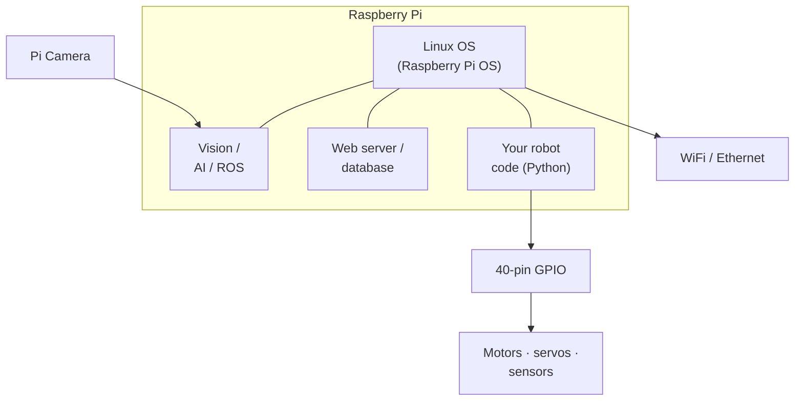

The Raspberry Pi is one of those bits of kit that genuinely changed what's possible for makers. A proper Linux computer, about the size of a bank card, that you can wire up to motors, sensors, cameras — and robots.

## What is Raspberry Pi?

Raspberry Pi is a single-board computer (SBC) made by the Raspberry Pi Foundation in Cambridge, UK. Unlike a microcontroller (which runs one program in a loop), the Pi runs a full operating system — usually Raspberry Pi OS, a flavour of Debian Linux. That means you get a file system, networking, multiple processes, and the full Python standard library all at once.

The current flagship is the **Raspberry Pi 5**, which packs a quad-core 64-bit Arm Cortex-A76 processor, up to 8 GB of RAM, PCIe support for NVMe storage, and a capable GPU. Earlier models like the Pi 4 and Pi Zero 2 W are still widely used and plenty powerful for most robot projects.

Key specs (Raspberry Pi 5, 4 GB model):
- **CPU:** 2.4 GHz quad-core Cortex-A76
- **RAM:** 4 GB or 8 GB LPDDR4X
- **GPIO:** 40-pin header
- **Connectivity:** Gigabit Ethernet, dual-band WiFi, Bluetooth 5.0
- **Camera:** 2× MIPI camera connectors

## A computer, not just a chip

The difference between a Pi and a microcontroller is the **operating system** in the middle. On a Pico your code runs directly on the metal; on a Pi, Linux sits underneath and lets a vision pipeline, a web server and your robot code all run at once — while the same 40-pin GPIO header still drives motors and reads sensors:

That's why the Pi is the brain of choice when a robot needs to *think* — recognising faces, planning routes, or chatting to an LLM — rather than just react.

## Why robot builders care

The Pi shines when your robot needs to *think*. Computer vision, object detection, running ROS, talking to an LLM, streaming video — these all need real compute, a proper OS, and decent RAM. A microcontroller can't touch that.

The 40-pin GPIO header lets you connect motors, sensors, servos, and displays directly, just like you would on an Arduino or Pico. The difference is that your control code runs alongside a web server, a database, or a real-time video pipeline in the same box.

The Pi also runs Docker, which makes deploying and updating software on your robot surprisingly clean — spin up a container for ROS, another for your vision pipeline, and let the OS keep them isolated.

## Get started

The best first step is getting Raspberry Pi OS installed and configured. The [How to install Raspberry Pi OS](/blog/how-to-install-raspberrypi-os.html) guide walks you through using Raspberry Pi Imager, enabling SSH, and connecting to your network — the same setup every robotics project begins with.

Once your Pi is running, try building something physical. The [Building a Robot Arm with Raspberry Pi and PCA9685](/learn/pca9685/01_course_introduction.html) course is a brilliant starting point — you'll control multiple servos over I2C and write Python to sequence movements. It teaches the GPIO workflow that carries over to almost every Pi robot project.

If you want to push further into vision and AI, the [Computer Vision on Raspberry Pi with CVZone](/learn/cvzone/00_intro.html) course shows you how to run real-time object detection and tracking using a Pi camera and Python — no cloud required.

And when your single Pi turns into a cluster, the [Raspberry Pi 5 Cluster with Docker Swarm](/learn/docker_swarm/00_intro.html) course shows you how to orchestrate containers across multiple boards — which is exactly how Kevin runs kevsrobots.com itself.
