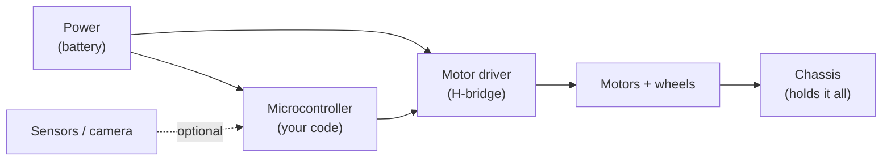

Rovers are the classic wheeled robots that get you from "blinking an LED" to "actually driving a robot around the living room." They are the natural destination for everything you've been learning.

## What is a Rover?

A rover is a ground-based mobile robot that moves on wheels (or occasionally tracks). In robotics terms, it's any self-contained wheeled platform that can be driven, either remotely by a human or autonomously under its own control.

The word conjures images of NASA's Perseverance crawling across Martian rock, but your first rover is far more achievable than that. A basic rover needs just four things: a chassis to hold everything together, motors and wheels to move, a microcontroller to run your code, and a power source. That's genuinely it. Everything else — sensors, cameras, wireless control, autonomy — is optional and can be added later.

Here's that minimal rover as a block diagram. These four blocks get you a driving robot; the dashed extras are what you bolt on as you grow:

Typical beginner rovers use two DC motors in a *differential drive* arrangement: speed up the left motor and the robot turns right, reverse it and the robot spins on the spot. This simple geometry is surprisingly capable and very easy to program.

Typical beginner rovers use two DC motors in a *differential drive* arrangement: speed up the left motor and the robot turns right, reverse it and the robot spins on the spot. This simple geometry is surprisingly capable and very easy to program.

## Why robot builders care

Rovers are where all the other skills in robotics come together for the first time. You'll wire up motors, write motion code, think about power budgets, and confront the very real question of "why is it spinning in circles instead of going straight?" (Spoiler: motors are never perfectly matched — PID control is your friend.)

Rovers are also scalable. You can start with a £10 kit chassis and a Raspberry Pi Pico and end up with a LiDAR-equipped mapping robot running SLAM. The fundamental platform stays the same; you just keep adding capability.

They also connect naturally to real-world robotics careers. Delivery robots, warehouse AGVs, search-and-rescue bots — these are all rovers with better sensors and smarter software.

## Get started

The best way to start is to build one. Kevin's [SMARS course](/learn/smars/00_intro.html) walks you through 3D printing and assembling a Screwless, Modular, Assemble-able Robotic System — a compact, beginner-friendly rover chassis that's been iterated on for years. It's a brilliant first build.

If you want a more capable platform straight away, take a look at the [Rover Mecanum build](/blog/Rover-mecanum.html) — a four-wheel mecanum drive robot that can strafe sideways as well as drive forward. It's a step up in complexity but the results are genuinely impressive.

Once your rover moves reliably, the next challenge is making it *think*. The [Viam SLAM](/blog/viam-slam.html) write-up shows how you can use a Raspberry Pi-based rover with a LiDAR to map a room in real time — a proper taste of autonomous navigation.

For your very first rover, try this: grab a small chassis kit (or print the SMARS body), wire up two DC motors through an H-Bridge, and write a simple MicroPython script that drives forward for two seconds, turns 90 degrees, and repeats. It sounds basic, but the moment it moves the way you intended, you'll be hooked.
