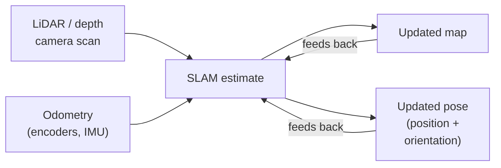

Your robot can't navigate well if it doesn't know where it is. And it can't know where it is without a map. SLAM solves both problems at once — and that's a genuinely remarkable thing.

## What is SLAM?

SLAM stands for **Simultaneous Localisation and Mapping**. It's the process a robot uses to build a map of an unknown environment *at the same time* as it works out its own position within that map. No GPS required, no pre-loaded blueprint.

In practice, SLAM fuses data from sensors — most commonly a [LiDAR](/periodic-table/ld.html) rangefinder or a depth camera — with odometry (wheel rotation counts, IMU readings) to continuously update two things: the map and the robot's estimated pose (position + orientation). Every new sensor reading refines both.

The maths behind it ranges from **particle filters** (used in ROS's gmapping) to **graph-based optimisation** (used in Cartographer and RTAB-Map). You don't need to master the maths to get results — but it helps to know that errors accumulate, and the algorithm is always correcting for drift.

## The chicken-and-egg loop

SLAM solves a circular problem: you need a map to know where you are, but you need to know where you are to build the map. It does both at once by feeding sensor scans and odometry into an estimate that refines *both* the map and the robot's pose every cycle:

Each new scan corrects a little of the drift that creeps into odometry, which is why the map gets sharper the more the robot explores — and why "loop closure" (recognising a place it's been before) is such a big moment for a SLAM system.

## Why robot builders care

If you want a robot that can:

- Explore a room autonomously without bumping into everything
- Return to a charging dock without a homing beacon
- Follow a repeatable route through a changing environment
- Avoid obstacles it has never seen before

…then SLAM is the foundation you build on. It's what turns a robot that *moves* into a robot that *navigates*. Combine it with a path-planning layer (like the ROS Navigation Stack) and your robot can set goals and route itself there without you touching a joystick.

Even small robots can do basic SLAM. A Raspberry Pi 5 paired with a low-cost 360° LiDAR and ROS 2 is enough to map a typical room in minutes.

## Get started

The best first step is to see SLAM working before you worry about building it yourself.

Kevin's [Viam SLAM project](/blog/viam-slam.html) is a great starting point — it walks through using Viam's cloud platform to map a real room with a Raspberry Pi robot. No ROS knowledge needed; the mapping happens in the browser dashboard while you drive the robot around by hand. It's a satisfying way to see occupancy-grid maps appear in real time.

Once you're ready to go deeper, the [Learn ROS with me course](/learn/learn_ros/00_intro.html) covers ROS 2 from the ground up, including the tools you need to run a proper SLAM stack. From there, Kevin's [Arduino Alvik maze navigation guide](/blog/alvik-maze.html) shows the full journey from simple wall-following to SLAM-based autonomous navigation — a neat progression that shows why the extra complexity is worth it.

Start by driving your robot manually and watching the map grow. Then try letting the robot plan its own path through the finished map. That moment when it routes itself around a chair it mapped five minutes ago never gets old.
