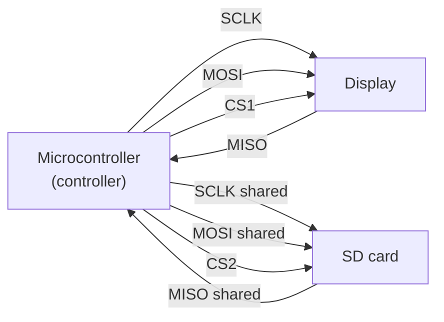

Want a colour screen on your robot? Need to log data to an SD card? SPI is almost certainly involved. It is one of the most widely used buses in hobby electronics, and once the wiring is right it is remarkably fast and easy to use.

## What is SPI?

SPI stands for **Serial Peripheral Interface** — a synchronous serial protocol that has been a staple of embedded hardware since the mid-1980s.

It uses four wires:

| Wire | Name | Job |
|------|------|-----|
| SCLK | Clock | Sets the timing for each bit |
| MOSI | Controller Out / Peripheral In | Sends data from your microcontroller |
| MISO | Controller In / Peripheral Out | Receives data back |
| CS / CE | Chip Select | Tells a specific device "I'm talking to you" |

Multiple devices can share the SCLK, MOSI and MISO lines, each with its own CS pin — the controller pulls CS low to start a conversation and high again to finish.

Typical SPI speeds range from a few MHz up to 80 MHz on some ESP32 devices — far faster than I2C or UART, which is what makes SPI the right choice for colour TFT displays, where you push thousands of pixels every frame.

## How the bus is wired

The clever bit is that the clock and data lines are *shared* by every device — only the **Chip Select** line is unique per peripheral. Pull one device's CS low and it listens; the others stay quiet:



SCLK, MOSI and MISO fan out to both devices; CS1 and CS2 are the separate "are you talking to me?" lines. Add a third device and you only need one more spare GPIO pin for its CS.

## Why robot builders care

You will run into SPI constantly when adding peripherals to a robot:

- **Colour displays** — almost every compact TFT or IPS screen (ST7789, ILI9341) uses SPI.
- **SD cards** — data logging, storing maps, reading audio files — all go through an SPI SD module.
- **High-speed sensors** — some IMUs, barometers and ADC chips prefer SPI when you need fast sample rates.

If I2C is the friendly slow lane, SPI is the fast lane — you trade a few extra pins for raw throughput.

## Get started

The best place to start is the [Talking to the World — Working with I2C and SPI](/learn/i2c_spi/00_intro.html) course. It covers both protocols side by side on the Raspberry Pi Pico — trade-offs, wiring, and code.

For a concrete project, the [Radar Robot](/blog/radar-robot.html) build uses the SPI bus to drive its display — great for seeing SPI in a real robot context.

In MicroPython, getting SPI going on a Pico takes about five lines:

```python
from machine import SPI, Pin

spi = SPI(0, baudrate=4_000_000, polarity=0, phase=0,
          sck=Pin(18), mosi=Pin(19), miso=Pin(16))
cs = Pin(17, Pin.OUT, value=1)
```

From there you can write to an SD card driver or a display library without much extra ceremony. For more project ideas, [10 Projects for your Raspberry Pi Pico](/blog/pico-projects.html) shows several builds that pull SPI peripherals into real robots and gadgets.

One quick tip: always check your device's required **CPOL** (clock polarity) and **CPHA** (clock phase) settings in its datasheet. Most displays and SD cards use mode 0, but some sensors are mode 3 — getting those two numbers wrong is the number one cause of SPI devices that appear wired correctly but refuse to respond.
