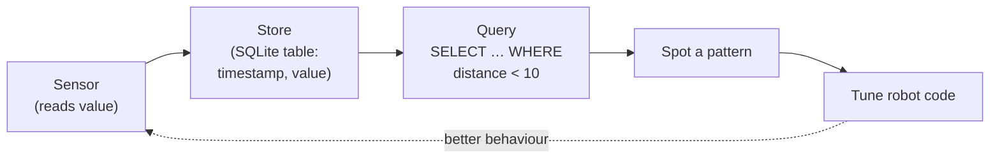

Your robot is collecting data constantly — distances, temperatures, battery voltage, button presses. Without somewhere to put that data, it vanishes the moment you power off. SQL and structured data storage give you a way to keep it, query it, and learn from it.

## What is SQL & Data?

SQL (Structured Query Language) is the standard language for talking to relational databases. You write short, readable commands like `SELECT * FROM sensor_logs WHERE distance < 20` and the database hands back exactly what you asked for.

On the embedded side, **SQLite** is the database of choice. It is a single file, needs no server, runs happily on a Raspberry Pi or even a Pi Pico W, and is built into Python's standard library. No installation required. For heavier analytics on a desktop or Pi, **DuckDB** is a newer option that can query millions of rows in seconds and reads CSV files directly — brilliant for post-mission analysis.

A typical robotics data stack looks like this:

- **Collect** — a sensor reads a value every 100 ms
- **Store** — Python writes it to an SQLite table with a timestamp
- **Query** — you ask "show me every time the ultrasonic distance dropped below 10 cm"
- **Act** — you spot a pattern and tune your avoidance code accordingly

## The data pipeline

That stack is a loop. A sensor produces a reading, Python stores it with a timestamp, you query the stored history to find patterns, and what you learn feeds back into better robot code:

The smallest useful table is just three columns — `timestamp`, `sensor`, `value` — yet it turns "I think the robot got stuck around 3pm" into a query that tells you exactly what every sensor was reading at that moment.

## Why robot builders care

Robots that log their sensor data are robots you can debug. Instead of guessing why your rover got stuck last Tuesday, you query the log and find out exactly what the IR sensor was seeing at the moment it stopped. Data also lets you train simple machine-learning models, spot hardware faults early (a motor that draws 20% more current than last week is about to fail), and share reproducible results with others.

Even a tiny table with three columns — `timestamp`, `sensor`, `value` — is infinitely more useful than print statements you forgot to remove.

## Get started

The easiest first project: log readings from any sensor to an SQLite database using Python, then query the results. Kevin's [Create Databases with Python and SQLite3](/learn/sqlite3/00_intro.html) course walks you through the whole thing from scratch, including creating tables, inserting rows, and running queries — no prior database knowledge needed.

Once you are comfortable with SQLite, the [Getting Started with SQL](/learn/sql/00_course_overview.html) course covers relational database theory properly: joins, indexes, normalisation, and writing queries that scale.

If you want to crunch larger datasets — say, weeks of telemetry from a long-running rover — take a look at the [DuckDB course](/learn/duckdb/00_intro.html). DuckDB can query a CSV or Parquet file directly without importing it first, which makes ad-hoc analysis surprisingly fast.

For Pi-based monitoring projects where you want graphs over time, pair SQLite or InfluxDB with [Telegraf on a Raspberry Pi](/blog/telegraf-on-pi.html) to pipe system and sensor metrics into a time-series store automatically.

Start small: one table, three columns, one sensor. Once the data is in there, you will wonder how you ever built robots without it.
