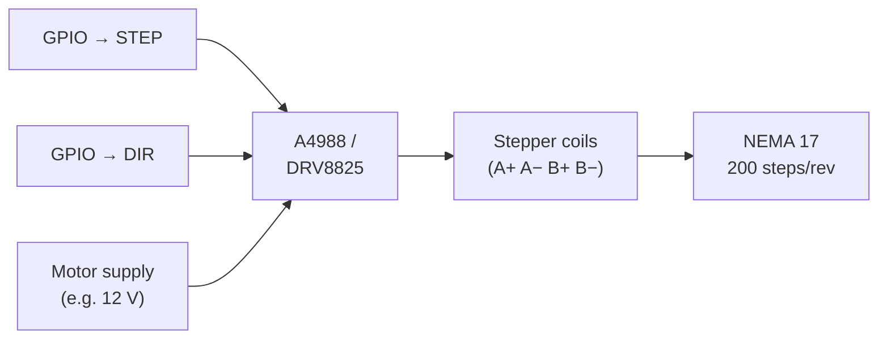

When you need a motor to move to *exactly* the right place — and stay there — a stepper motor is your best friend. These are the workhorses inside every 3D printer, CNC machine, and drawing robot on the planet.

## What is a Stepper Motor?

A stepper motor is a brushless DC motor that divides a full rotation into a fixed number of equal steps. A typical NEMA 17 motor has **200 steps per revolution** — 1.8 degrees per step. Tell it to move 50 steps and it moves exactly 50, every time, with no guesswork.

Unlike a regular DC motor that spins freely, a stepper motor has multiple electromagnetic coils inside. A driver board energises them in sequence, which pulls the rotor around one step at a time. Keep the coils energised and the motor holds its position firmly — no brake needed.

Key specs to know:

- **Steps per revolution** — 200 steps (1.8°) is most common; 400 steps (0.9°) gives finer resolution
- **NEMA size** — NEMA 17 is the standard for small robots and printers; NEMA 23 is beefier

The common driver chips — **A4988** and **DRV8825** — reduce the job to two control pins: one for direction, one for pulses. Each pulse advances the motor one step.

## How it steps

Inside the motor are coils the driver energises in a repeating sequence. Each change in the pattern tugs the rotor one step further round. This four-step full-step pattern is the basics of it (the driver chip handles it for you):

```
   Step   Coil A   Coil B      One STEP pulse = one move
   ────   ──────   ──────
    1       +        off
    2      off        +        Reverse the order (or flip
    3       −        off       the DIR pin) and the motor
    4      off        −        steps the other way.
    ↺  back to step 1
```

## Wiring the driver

You don't drive those coils directly — an A4988 or DRV8825 board does the heavy lifting. From your microcontroller you only need two signal pins: **STEP** (pulse it once per step) and **DIR** (high or low to choose direction):



Pulse STEP 200 times and a standard NEMA 17 turns exactly one full revolution. No encoder, no feedback loop — the count *is* the position.

## Why robot builders care

Precision is the superpower here. A DC motor with an encoder can tell you *roughly* where it is. A stepper motor just *is* where you told it to be — no feedback loop required.

That makes steppers ideal for:

- **Drawing robots** — pen plotters and wall-mounted drawing machines need repeatable X/Y positioning
- **3D printers** — every axis and the filament extruder uses a stepper
- **Linear actuators** — paired with a lead screw, a stepper becomes a precise linear slide

The trade-off is that steppers draw full current even when stationary, run warm, and can lose steps if you demand too much torque at high speed. They are not the right choice for wheels on a fast rover — [DC motors](/periodic-table/dc.html) win there. But for anything where *position* matters more than *speed*, steppers are hard to beat.

## Get started

The most satisfying first stepper project is a drawing robot — move two motors in coordinated bursts and watch a pen trace shapes on paper.

The [Wall Drawing Robot Tutorial](/learn/scrawly_wally/01_intro.html) builds exactly that: a Raspberry Pi Zero 2 W drives stepper motors that move a pen gondola across a wall-sized canvas. Its little cousin, the [BrachioGraph](/learn/brachiograph/00_intro.html), draws with servos instead — worth a look if you want to compare the two approaches.

For hardware, grab a NEMA 17 motor and an A4988 driver board, and connect them to a Raspberry Pi Pico or Arduino. Wire STEP to a GPIO pin, DIR to another, and write a loop that pulses STEP. You will see the motor tick forward one step at a time — that satisfying little click is precise, repeatable motion you can build on.
