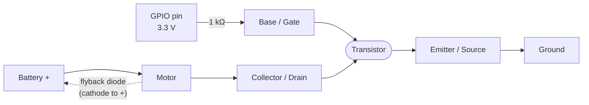

Without the transistor, there would be no microcontrollers, no motor drivers, and no robots. It is quite possibly the most important component ever invented — and there are billions of them inside the device you are reading this on.

## What is a Transistor?

A transistor is a three-legged semiconductor device that does one of two things: it acts as an electronic **switch**, or it acts as an **amplifier**. In robotics you will mostly use it as a switch — letting a tiny signal from a GPIO pin control a much larger current flowing to a motor, LED strip, or solenoid.

The two most common types you will meet are:

- **BJT (Bipolar Junction Transistor)** — a small current into the base pin switches a much larger current between collector and emitter. The classic NPN 2N2222 or BC547 handles up to 600 mA — plenty for small motors and buzzers.
- **MOSFET** — controlled by voltage rather than current, so it draws almost nothing from the GPIO pin. MOSFETs like the IRLZ44N switch several amps with barely any heat — ideal for larger motors and LED strips driven straight from a 3.3 V Pico pin.

Transistors are also the building block of logic gates — which is how computers (and microcontrollers) actually think.

## The symbol and pins

Every transistor has three legs. On a BJT they're the **Base** (the control pin), the **Collector**, and the **Emitter**. The little arrow tells you the type — it sits on the emitter and points *out* for an NPN, and *in* for a PNP:

```
        NPN                         PNP
                                
        C (Collector)               C (Collector)
        |                           |
        |                           |
  B ----|                     B ----|
 (Base) |\                   (Base) |/
        | \                         | \
        |  v                        |  ^
        |                           |
        E (Emitter)                 E (Emitter)
    arrow points OUT            arrow points IN
   (current flows out)        (current flows in)
```

A handy way to remember it: **N**PN = "**N**ot **P**ointing i**N**" — the arrow points away from the base.

A MOSFET does the same switching job but its three pins have different names: the **Gate** (control), the **Drain**, and the **Source**. The gate is voltage-controlled and electrically isolated, so it draws almost no current from your GPIO pin:

```
   N-channel MOSFET (enhancement)

        D (Drain)
        |
        |
  G ----| |        G = Gate   (control voltage)
(Gate)  | |---+     D = Drain  (load side)
        | |   |     S = Source (ground side)
        |     v
        |
        S (Source)
```

For switching a motor or LED strip from a microcontroller, you wire it as a **low-side switch**: the load sits between the positive rail and the Drain, the Source goes to ground, and your GPIO pin drives the Gate (through a resistor) to turn it on.

## In a circuit

Here's the classic way a transistor lets a 3.3 V GPIO pin switch a much hungrier motor. The flyback diode across the motor catches the voltage spike when the motor switches off — leave it out and that spike can destroy the transistor:



When the GPIO pin goes high, the transistor turns on, current flows through the motor, and it spins. When the pin goes low, the transistor switches off. A tiny signal controlling a big load — that's the whole trick.

## Why robot builders care

Every time a Raspberry Pi Pico tells a motor to spin, a transistor — or many of them — is doing the heavy lifting. A GPIO pin can only source a few milliamps. A motor needs hundreds. A transistor bridges that gap.

Where you will find them in your builds:

- **H-bridge motor drivers** (L298N, DRV8833) — these ICs are essentially four transistors arranged to let you reverse a motor's direction.
- **PWM speed control** — rapidly switching a MOSFET on and off gives you smooth speed control over motors and servos.

Understanding how a transistor works means you can read motor driver datasheets, debug back-EMF resets, and design your own drive circuits when an off-the-shelf module is not quite right.

## Get started

The fastest way to understand a transistor is to build a simple switching circuit on a breadboard. Wire up an NPN BJT with an LED and resistor on the collector side, connect the base to a GPIO pin via a 1 kΩ resistor, and write three lines of MicroPython to toggle the pin — the transistor switches the LED using a signal that barely draws any current at all.

Once that clicks, step up to motor control. The [MicroPython Robotics Projects with the Raspberry Pi Pico](/learn/micropython_robotics/01_intro.html) course covers DC motors and, crucially, the H-bridge driver — which is built entirely around transistors. The lesson on [Using H-Bridge Motor Drivers](/learn/micropython_robotics/03_hbridge_control.html) explains exactly how transistors act as the four switches inside the "H", giving you forward, reverse, and braking in a single compact IC.

Once you are comfortable switching loads, try a MOSFET on an LED strip or a larger motor — that is when these three-legged marvels really shine.
