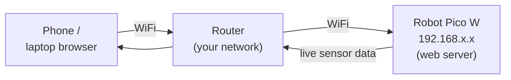

Give your robot an IP address and a whole new world of possibilities opens up. WiFi turns a standalone machine into something you can poke from your phone, update without a USB cable, or have reporting data to a dashboard in real time.

## What is WiFi?

WiFi is a wireless networking standard based on the IEEE 802.11 family of protocols. It lets devices join a local network (or the internet) over a radio link — typically at 2.4 GHz or 5 GHz.

For robots, the numbers that matter most are:

- **2.4 GHz** — longer range, better wall penetration, used by almost all microcontroller boards
- **Typical indoor range** — 20–50 metres from a router
- **SSID / password** — your network credentials (keep them in a config file, not hardcoded in public repos)

The boards you will most likely use are the **Raspberry Pi Pico W**, the **ESP32**, and the full **Raspberry Pi** — all well supported in MicroPython and Python.

## On the network

Once your robot joins WiFi it gets an IP address, just like every other device on the network. Your phone or laptop reaches it through the router — no cable, and you can drive it from any browser on the same network:

The robot runs a tiny web server, so the "remote control" is just a web page it serves itself. Open its IP address in a browser and the buttons on the page send commands straight back to the robot.

## Why robot builders care

WiFi removes the tether. Instead of crouching next to your robot with a USB cable to upload new code or read sensor values, you can:

- **Control it remotely** — serve a tiny web page from the robot itself and use buttons in your browser to drive it
- **Stream sensor data** — post temperature, distance, or IMU readings to a server every few seconds
- **Update code over the air (OTA)** — push a new firmware file to the robot without touching it
- **Coordinate multiple robots** — have them publish and subscribe to messages over MQTT so they share information

The trade-off is power: a WiFi radio draws 80–200 mA during active transmission, which matters a lot if your robot runs on a small battery. Connect, send a burst of data, then sleep the radio — a common pattern for battery-powered builds.

## Get started

The quickest way in is the Raspberry Pi Pico W and MicroPython. The `network` and `socket` modules give you everything you need to connect to your router and open a basic HTTP server in about 20 lines of code.

A great early project is a WiFi-controlled robot arm. Kevin's [Simple Robot Arm](/blog/simple-robot-arm.html) post shows exactly this: a Pimoroni Inventor 2040 W serving a web interface that lets you drive servos from any browser on your network — no app install needed.

For a wheeled robot, [BurgerBot](/blog/burgerbot.html) is built around the Pico W and uses WiFi for remote control. It is one of the friendliest first WiFi robot builds on the site.

To understand the WiFi setup code itself, the [How to setup a Phew! Access Point](/blog/phew-access-point.html) post walks through creating a captive portal with Phew! — a lightweight MicroPython web framework, ideal for hosting a robot control page without an internet connection.

Once you have basic connectivity working, the natural next step is [MQTT](/periodic-table/mq.html) — a lightweight messaging protocol that lets multiple robots and devices talk to each other with very little code.
